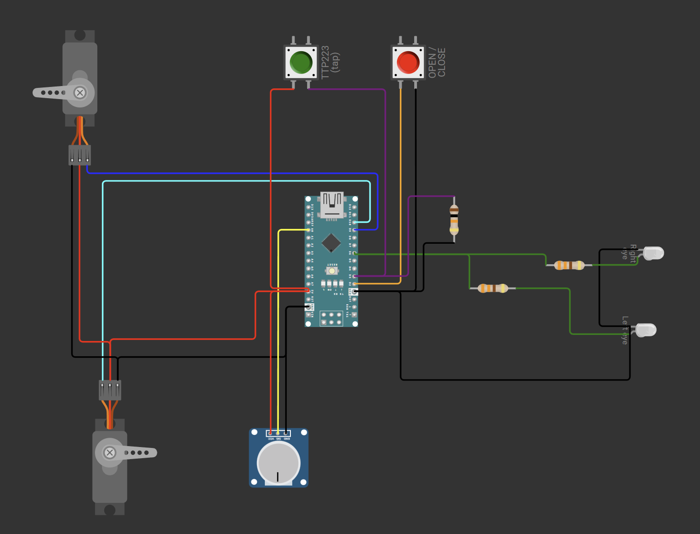

# IronManMaskController

Code to run on an Arduino Nano that controls a 3D printed Iron Man mask.

## Features

1. Light up eyes with a potentiometer dimmer.
2. Close and open via servos with a press of a button.
3. With an optional tap sensor (TTP223 capacitive touch) to open and close.
4. The eyes come on when the mask closes and go off when it opens.
5. The battery pack is the on/off switch.
6. The eyes go off after 10 minutes.

## How it works

- A single **button press** *or* a **tap** on the touch pad toggles the faceplate
  between open and closed.
- Closing the mask runs an Iron-Man-style "power up" flicker and lights the eyes;
  opening it switches the eyes off.
- While the eyes are lit, the **potentiometer** sets their brightness in real time.
- Ten minutes after the eyes come on they switch off automatically to save the
  battery (the mask stays closed).
  - **After the auto-off, the first press/tap re-lights the eyes** (and restarts
    the 10-minute timer) rather than opening the mask. Press/tap **again** to open.
- There is no software power switch — the mask powers up the moment the battery
  pack switch is turned on.

---

## Bill of materials

| Qty | Part | Notes |
|----:|------|-------|
| 1 | Arduino Nano (ATmega328P) | Clone boards are fine; most use a CH340 USB chip (driver needed). |
| 2 | Hobby servos (SG90 / MG90S) | One for the top jaw, one for the bottom/chin. MG90S (metal gear) recommended. |
| 1 | Potentiometer, 10 kΩ | Eye brightness dimmer. |
| 1 | Momentary push button | Open/close trigger. |
| 1 | TTP223 capacitive touch module | *Optional* tap sensor. Active-HIGH, momentary mode (default). |
| 2 | Low-current LEDs | The eyes. White/blue are typical. Driven straight from pin `D6`. |
| 2 | Resistor, 220–470 Ω | One per LED, for current limiting. |
| 1 | Battery pack **with switch**, 5–6 V | e.g. 4×AA NiMH (~4.8–5 V) or a 5 V USB power bank with an inline switch. |
| 1 | Capacitor, 470–1000 µF | Bulk capacitor across the servo supply (smooths current spikes). |
| — | Hookup wire, headers | — |

---

## Pin / wiring reference

These match the constants at the top of [IronManMaskController.ino](IronManMaskController.ino) — change them in one place if you wire differently.

| Arduino pin | Connects to | Direction | Notes |
|-------------|-------------|-----------|-------|
| `D2`  | Push button | Input (`INPUT_PULLUP`) | Other button leg to **GND**. Pressed = LOW. |
| `D3`  | TTP223 `SIG`/`I/O` | Input | Active-HIGH (HIGH when touched). |
| `D6`  | Eye LEDs (each via a resistor) | Output (PWM) | Drives & dims the eyes directly. Must be a PWM pin. Keep total LED current ≤ ~20 mA. |
| `A0`  | Potentiometer wiper | Analog in | Outer pot legs to 5 V and GND. |
| `D9`  | Top servo signal | Output | Servo V+ and GND go to the battery rail, **not** a data pin. |
| `D10` | Bottom servo signal | Output | " |
| `5V`  | TTP223 VCC, pot leg, (servo V+ if using a 5 V pack) | Power | See power notes below. |
| `GND` | Common ground for **everything** | Power | All grounds must be tied together. |

---

## Circuit diagram



The diagram above shows the complete wiring. The text schematics below break out
each section if you prefer a pin-by-pin reference.

### Overview

```
                          ┌──────────────────────────────────┐
                          │            Arduino Nano           │
   Push button            │                                   │
   ┌──[ BTN ]──┐          │  D2  ◄──────────── push button    │
  D2           │          │  D3  ◄──────────── TTP223  SIG     │
   │          GND         │  A0  ◄──────────── pot wiper       │
   └── to D2              │  D6  ──────────► eye LEDs (via R)  │
                          │  D9  ────────────► top servo  (sig)│
   TTP223                 │  D10 ────────────► bottom servo(sig)│
   VCC ─── 5V             │                                   │
   GND ─── GND            │  5V  ────────────► sensors / pot   │
   SIG ─── D3             │  GND ────────────► COMMON GROUND   │
                          └──────────────────────────────────┘

   Battery pack (5–6 V, with ON/OFF switch)
      (+) ──► 5V rail  ──► Arduino 5V pin, servo V+, TTP223 VCC
      (–) ──► GND rail ──► Arduino GND, servo GND, everything else
              (add 470–1000 µF across the servo V+/GND rail)
```

### Eye LEDs (driven directly from D6)

The eyes are low-current LEDs wired straight to `D6`, which both switches them
and PWM-dims them — no transistor needed.

```
   D6 ──┬──[220–470Ω]──▶|── GND     left eye:  resistor → LED → GND
        │
        └──[220–470Ω]──▶|── GND     right eye: resistor → LED → GND
```

- One resistor **per** LED. `▶|` is the LED — **anode** (long leg) toward `D6`,
  **cathode** (flat side) to `GND`.
- Keep the **combined** current of both eyes within the pin's safe range — aim
  for ~8–12 mA per LED (≈20 mA total). 220 Ω is a good start for red/green; use
  330–470 Ω for white/blue or to tone the eyes down.
- This is fine because the LEDs are low current. If you ever swap in an LED
  **ring/strip** (or anything pulling more than ~20 mA total), drive it through a
  logic-level MOSFET from `D6` instead so the pin isn't overloaded.

### Potentiometer (dimmer)

```
   5V ──[ pot leg 1 ]
              wiper ── A0
  GND ──[ pot leg 3 ]
```

### Push button

```
   D2 ──[ button ]── GND      (uses the Nano's internal pull-up)
```

### Servos

```
   D9  ── top servo    signal (orange/white)
   D10 ── bottom servo signal
   +5–6V ── both servos  V+   (red)     ◄── from the battery rail
   GND   ── both servos  GND  (brown/black)
```

---

## Edit & simulate the circuit online (Wokwi)

This repo includes an editable [Wokwi](https://wokwi.com) project so you can
rearrange the wiring — and even **run the firmware in a live simulator** — using a
free, browser-based tool (no install).

Project files:

- [diagram.json](diagram.json) — the circuit (parts + wiring).
- [libraries.txt](libraries.txt) — tells Wokwi to load the `ServoEasing` library.

**To open it:**

1. Go to <https://wokwi.com>, sign in (free), and create a new **Arduino Nano**
   project.
2. Replace the contents of the project's `sketch.ino` with
   [IronManMaskController.ino](IronManMaskController.ino).
3. Click the `diagram.json` tab and paste in this repo's
   [diagram.json](diagram.json).
4. Add the **ServoEasing** library: in the **Library Manager** (the 📚 / "+" in
   the Libraries panel) search for `ServoEasing` and add it. (The included
   [libraries.txt](libraries.txt) covers this if you import the files directly.)
5. Press the green ▶ to start the simulation. Click the **red button** (or the
   **green touch-sensor stand-in**) to open/close the mask, and drag the
   **potentiometer** to dim the eyes.

**About the tap sensor in the sim:** Wokwi has no TTP223 part, so the diagram
mimics it with a second push button wired active-HIGH (to `5V`) plus a 10 kΩ
pull-down on `D3` — that reproduces the TTP223's "HIGH when touched" behavior. On
your real hardware this is the TTP223 module (`VCC`/`GND`/`SIG` → `5V`/`GND`/`D3`).

> The simulated battery/servo power comes from the Nano's `5V` pin for
> convenience. On the real build, still power the servos from the battery rail as
> described below.

---

## Power notes (read this)

- **Power the servos from the battery rail, not from the Arduino's regulator.**
  Two servos under load can pull more current than the onboard regulator can
  supply and will brown-out / reset the board.
- **Tie all grounds together** — battery, Arduino, servos, LEDs, sensors. A
  shared ground is required for the signals to work.
- Recommended supply: a **5 V pack** (4×AA NiMH ≈ 4.8–5 V, or a regulated 5 V
  pack). Feed it to the Arduino **`5V` pin** and to the servo/LED rail.
  - If you use a **6 V** alkaline pack (4×AA), the servos are happy at 6 V, but
    feed the Arduino through its **`VIN`** pin instead of the `5V` pin.
  - A **USB power bank** works but many models auto-shut-off at the low idle
    current this circuit draws — a AA battery holder avoids that.
- Add the **470–1000 µF capacitor** across the servo V+/GND close to the servos
  to absorb current spikes when they move.

---

## Loading the program onto the Arduino

1. **Install the Arduino IDE** (2.x): <https://www.arduino.cc/en/software>.
2. **Install the USB driver if needed.** Most clone Nanos use the **CH340** chip.
   If no COM port appears when you plug the board in, install the CH340 driver,
   then re-plug the board.
3. **Install the ServoEasing library.** In the IDE:
   `Tools → Manage Libraries…` → search **"ServoEasing"** (by *Armin
   Joachimsmeyer*) → **Install**.
4. **Open the sketch.** Open
   [IronManMaskController.ino](IronManMaskController.ino). It must stay inside a
   folder named `IronManMaskController` (it already is) — that's an Arduino
   requirement.
5. **Select the board:** `Tools → Board → Arduino AVR Boards → Arduino Nano`.
6. **Select the processor:** `Tools → Processor → ATmega328P`.
   - If upload fails with a `avrdude: stk500_recv(): programmer is not
     responding` / sync error, switch to **`ATmega328P (Old Bootloader)`**
     (common on clone Nanos) and try again.
7. **Select the port:** `Tools → Port → COMx` (the one that appears when the
   board is plugged in).
8. **Upload:** click the **→** (Upload) button and wait for **"Done uploading."**
9. **Run it on battery.** Disconnect USB and power the mask from the battery
   pack — flipping the pack's switch on boots the controller.

> Tip: you can keep the board on USB while bench-testing the button, pot, and
> eyes, but always power the **servos from the battery rail**, even during
> testing.

---

## Calibration & tuning

All tunable values are constants at the top of
[IronManMaskController.ino](IronManMaskController.ino):

- `TOP_OPEN` / `TOP_CLOSED` / `BOTTOM_OPEN` / `BOTTOM_CLOSED` — servo angles for
  the open and closed positions. Adjust to fit your printed mechanism. Start with
  the servos detached, find the angles by trial, then attach the horns.
- `SERVO_SPEED` — how fast the faceplate moves, in degrees/second.
- `POT_MIN` / `POT_MAX` — the raw `analogRead` range (0–1023) of your pot that maps
  to off → full brightness. Widen to `0` / `1023` to use the pot's full travel.
- `EYE_TIMEOUT_MS` — the auto-off delay (default 10 minutes).
- `DEBOUNCE_MS` — button/touch debounce window.

---

## Troubleshooting

| Symptom | Likely cause / fix |
|---------|--------------------|
| No COM port in the IDE | Install the **CH340** driver; try another USB cable/port. |
| Upload "not responding" / sync error | Set `Tools → Processor → ATmega328P (Old Bootloader)`. |
| Board resets or servos jitter when moving | Servos drawing too much from the Arduino — power them from the battery rail, add the bulk capacitor, share grounds. |
| Mask slams shut right at power-on | An input was active at boot. The firmware seeds input state at startup to avoid this; also check the button/touch wiring isn't stuck active. |
| Eyes never light | Check LED polarity (anode to `D6` via the resistor, cathode to GND), the resistor value, and that the brightness pot isn't at zero. |
| Eyes won't dim | Pot wiper must be on `A0`; check `POT_MIN`/`POT_MAX`. |
| Touch pad does nothing | Confirm the TTP223 is in default active-HIGH momentary mode and `SIG` is on `D3`. |
